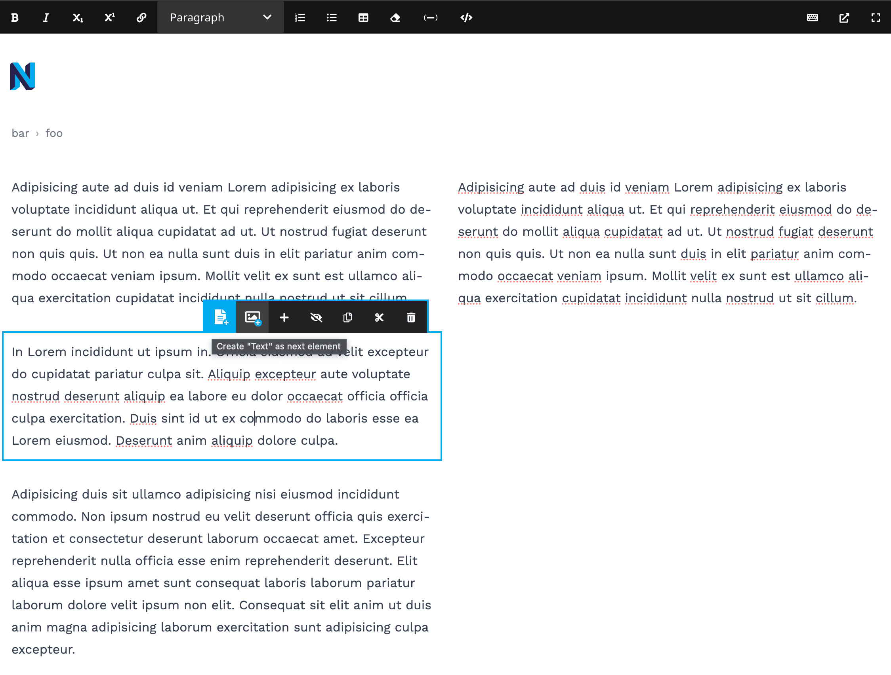

# Neos CMS Ui plugin to quickly create a follow up content element while editing a page

This plugin allows defining other nodetypes as "next" nodetypes, which can be used to quickly create a follow-up content element while editing a page in the Neos CMS backend.

## Installation

```console
composer require shel/neos-next-node
```

## Example configuration

```yaml
'Neos.Demo:Content.Text':
  options:
    nextNodeTypes:
      'Neos.Demo:Content.Text': true
      'Neos.Demo:Content.Image': true
```

This would lead to the following additional buttons in the Neos CMS backend:



⚠️The default behaviour is to show the same nodetype as next nodetype. If you want to change this, you have to explicitly configure the `nextNodeTypes` option. This also means, that you only have to adjust this setting for a nodetype if you want a different behaviour than the default one.

## Hotkeys

The plugin also registers hotkeys for quickly creating a follow-up content element:

* Ctrl + Enter
* Cmd + Enter (Mac)

## Configuration options

Copy the following configuration into your `Settings.yaml` to adjust the plugin's behaviour:

```yaml
Neos:
  Neos:
    Ui:
      frontendConfiguration:
        'Shel.Neos.Next.Node:ToolBar':
          # If no `nextNodeTypes` is configured for a node type, the current node type will be used as fallback.
          currentNodeTypeAsFallback: true
```

## Development — Build a new version

Run the following commands in the `ui-plugin` folder to build a new version of the plugin:

```console
yarn
yarn build
```

Or during development, run

```console
yarn watch
```

## Sponsors

The public first release of this package was generously sponsored by [Vogel communications group](https://www.vogel.de).

## License

See [License](LICENSE.txt)
